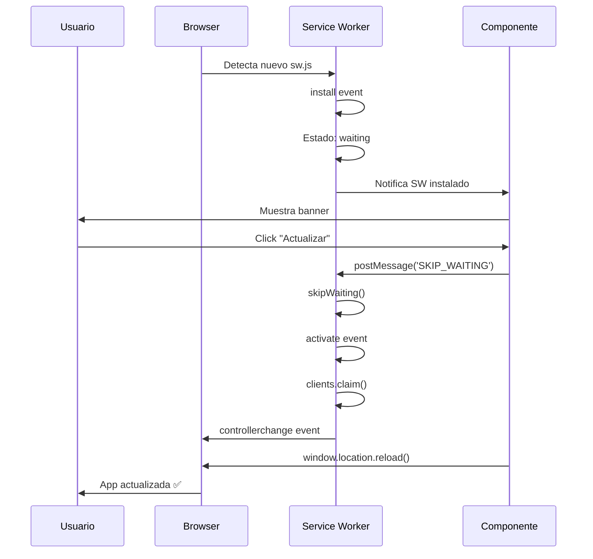

# Sistema de Auto-Actualización PWA

## 📋 Descripción

Sistema implementado para detectar automáticamente cuando hay una nueva versión del Service Worker y permitir al usuario actualizar la app sin tener que cerrarla manualmente.

## 🎯 Características

✅ **Detección automática** de nuevas versiones del SW  
✅ **Banner elegante** con notificación visual  
✅ **Actualización controlada** con skipWaiting  
✅ **Funciona en todas las páginas** (/local, /pass, /staff, etc.)  
✅ **Verificación periódica** cada 60 segundos  
✅ **UX mejorada** con opción de cerrar el banner

## 🏗️ Arquitectura

### 1. Service Worker Mejorado (`public/sw.js`)

```javascript
// Escucha mensajes del cliente para activar skipWaiting
self.addEventListener('message', (event) => {
    if (event.data && event.data.type === 'SKIP_WAITING') {
        self.skipWaiting()
    }
})

// Toma control inmediatamente al activarse
self.addEventListener('activate', (event) => {
    event.waitUntil(
        // ... limpiar caches antiguos
        .then(() => self.clients.claim())
    )
})
```

**Cambios clave:**
- ❌ NO hace `skipWaiting()` automático en install
- ✅ Espera mensaje del cliente para activarse
- ✅ Usa `clients.claim()` para tomar control inmediato
- ✅ Logs detallados para debugging

### 2. Componente React (`src/components/UpdateNotification.tsx`)

```typescript
// Detecta cuando hay un SW esperando
useEffect(() => {
    const detectUpdate = async () => {
        const reg = await navigator.serviceWorker.getRegistration()
        
        // SW ya esperando
        if (reg.waiting) {
            setShowUpdate(true)
        }
        
        // Escuchar nuevos SWs
        reg.addEventListener('updatefound', () => {
            const newWorker = reg.installing
            newWorker.addEventListener('statechange', () => {
                if (newWorker.state === 'installed' && navigator.serviceWorker.controller) {
                    setShowUpdate(true)
                }
            })
        })
    }
    
    detectUpdate()
    
    // Verificar cada 60 segundos
    const interval = setInterval(() => {
        navigator.serviceWorker.getRegistration().then(reg => reg?.update())
    }, 60000)
    
    return () => clearInterval(interval)
}, [])
```

**Características:**
- Detecta SW esperando al cargar
- Escucha evento `updatefound`
- Verifica actualizaciones periódicamente
- Maneja el flujo de actualización completo

### 3. UI del Banner

```tsx
<div className="fixed bottom-4 left-4 right-4 z-[9999]">
    <div className="bg-gradient-to-r from-blue-600 to-blue-700 ...">
        <!-- Ícono de actualización -->
        <div>Nueva versión disponible</div>
        <button onClick={handleUpdate}>Actualizar</button>
        <button onClick={handleDismiss}>✕</button>
    </div>
</div>
```

**Diseño:**
- 🎨 Gradiente azul elegante
- 🔔 Ícono de actualización circular
- 📱 Responsive y centrado
- ⚡ Animación slide-in desde abajo
- 🎯 z-index alto (9999) para estar siempre visible

## 🔄 Flujo de Actualización



## 📝 Integración

El componente está integrado en el layout principal:

```tsx
// src/app/layout.tsx
import UpdateNotification from '@/components/UpdateNotification'

export default function RootLayout({ children }) {
  return (
    <html lang="es">
      <body>
        {children}
        <UpdateNotification /> {/* Disponible en todas las páginas */}
      </body>
    </html>
  )
}
```

## 🧪 Testing

### Prueba Local

1. **Deploy inicial:**
   ```bash
   npm run build
   npm start
   ```

2. **Cambiar versión del cache:**
   ```javascript
   // public/sw.js
   const CACHE_NAME = 'fidelizacion-zona-v3' // Incrementar
   ```

3. **Rebuild y redeploy:**
   ```bash
   npm run build
   npm start
   ```

4. **Verificar:**
   - Abrir la app en el navegador
   - Esperar 60 segundos (verificación automática)
   - O recargar la página
   - Debería aparecer el banner "Nueva versión disponible"
   - Click en "Actualizar"
   - La app se recarga con la nueva versión

### Debugging en DevTools

```javascript
// Console
navigator.serviceWorker.getRegistration().then(reg => {
    console.log('Active:', reg.active?.state)
    console.log('Waiting:', reg.waiting?.state)
    console.log('Installing:', reg.installing?.state)
})

// Forzar actualización manual
navigator.serviceWorker.getRegistration().then(reg => reg.update())
```

## 🚀 Deploy en Producción

1. **Cambiar CACHE_NAME en `public/sw.js`:**
   ```javascript
   const CACHE_NAME = 'fidelizacion-zona-v3' // Incrementar número
   ```

2. **Commit y push:**
   ```bash
   git add .
   git commit -m "feat: Sistema de auto-actualización PWA"
   git push
   ```

3. **Vercel auto-deploya** la nueva versión

4. **Los usuarios verán el banner** cuando:
   - Abran la app después del deploy
   - La app verifique automáticamente cada 60s
   - Recarguen la página manualmente

## ⚙️ Configuración

### Intervalo de Verificación

```typescript
// src/components/UpdateNotification.tsx
const interval = setInterval(() => {
    navigator.serviceWorker.getRegistration().then(reg => reg?.update())
}, 60000) // 60 segundos - ajustar según necesidad
```

### Versión del Cache

```javascript
// public/sw.js
const CACHE_NAME = 'fidelizacion-zona-vX' // Incrementar en cada deploy importante
```

**Cuándo incrementar:**
- ✅ Nuevas features importantes
- ✅ Fixes críticos
- ✅ Cambios en la UI principal
- ❌ NO en cada commit pequeño

## 🎨 Personalización del Banner

### Colores
```tsx
// Cambiar de azul a otro color
className="bg-gradient-to-r from-purple-600 to-purple-700"
```

### Posición
```tsx
// Arriba en lugar de abajo
className="fixed top-4 left-4 right-4"
```

### Tamaño
```tsx
// Más ancho
className="... max-w-lg mx-auto"
```

## 🔍 Troubleshooting

### El banner no aparece

1. **Verificar registro del SW:**
   ```javascript
   navigator.serviceWorker.getRegistration()
   ```

2. **Verificar estado del SW:**
   - Chrome DevTools → Application → Service Workers
   - Debería mostrar "waiting to activate"

3. **Forzar actualización:**
   ```javascript
   navigator.serviceWorker.getRegistration().then(reg => reg.update())
   ```

### El banner aparece pero no actualiza

1. **Verificar mensaje postMessage:**
   - Check en Network tab que el mensaje se envía
   
2. **Verificar logs del SW:**
   - Console debería mostrar "📨 SW: Message received"
   
3. **Verificar skipWaiting:**
   - Console debería mostrar "⚡ SW: Activating new version immediately..."

### Actualización en loop

- ❌ **Problema:** skipWaiting() se llama automáticamente en install
- ✅ **Solución:** Solo llamar skipWaiting() cuando el usuario hace click

## 📱 Compatibilidad

- ✅ Chrome/Edge 40+
- ✅ Firefox 44+
- ✅ Safari 11.1+
- ✅ iOS Safari 11.3+
- ✅ Chrome Android
- ✅ Samsung Internet

## 🔐 Seguridad

- ✅ Solo actualiza desde el mismo origen
- ✅ HTTPS requerido (o localhost)
- ✅ No ejecuta código no verificado
- ✅ Usuario tiene control total

## 📊 Métricas Sugeridas

Para tracking de adopción:

```typescript
const handleUpdate = () => {
    // Analytics event
    if (typeof gtag !== 'undefined') {
        gtag('event', 'pwa_update', {
            event_category: 'engagement',
            event_label: 'user_initiated_update'
        })
    }
    
    // Continuar con la actualización...
}
```

## 🎯 Mejoras Futuras

- [ ] Mostrar changelog en el banner
- [ ] Opción "Actualizar más tarde"
- [ ] Badge con número de versión
- [ ] Notificación push cuando hay actualización
- [ ] Auto-actualizar en horarios específicos
- [ ] A/B testing de diferentes mensajes

## 📚 Referencias

- [Service Worker Lifecycle](https://web.dev/service-worker-lifecycle/)
- [skipWaiting() API](https://developer.mozilla.org/en-US/docs/Web/API/ServiceWorkerGlobalScope/skipWaiting)
- [PWA Update Patterns](https://web.dev/articles/handling-service-worker-updates)
