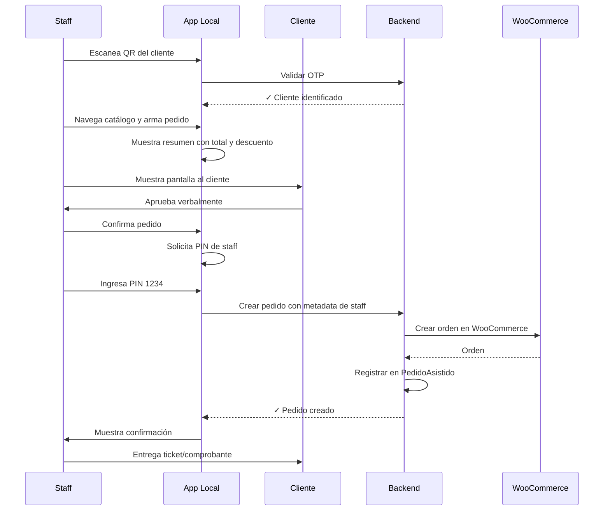

# Análisis: Pedidos de Tortas Asistidos por Staff

## 📋 Resumen Ejecutivo

Esta funcionalidad permitiría que los empleados tomen pedidos de tortas en nombre de clientes desde la app de atención al cliente ([`/local`](../src/app/local/page.tsx)), escaneando el QR del cliente y navegando el catálogo de productos por ellos.

**Estado Actual:** La app `/local` solo puede:
- ✅ Escanear QR del cliente
- ✅ Ver información del cliente (nivel, autos, beneficios)
- ✅ Aplicar beneficios
- ✅ Registrar visitas
- ✅ Gestionar sesiones de mesas en salón
- ❌ **NO puede** navegar productos ni crear pedidos

---

## 🔐 Análisis de Vulnerabilidades y Riesgos

### 1. **Vulnerabilidades de Autenticación**

#### Riesgo Alto 🔴
- **Abuso de Descuentos:** Staff podría crear pedidos para amigos/familiares usando los descuentos de otros clientes
- **Suplantación:** Una vez escaneado el QR, el staff tiene acceso total a la cuenta del cliente durante la sesión
- **Falta de Trazabilidad:** No hay registro de QUÉ empleado específico creó cada pedido

#### Ejemplo de Abuso:
```
1. Staff escanea QR de cliente "Platino" (20% descuento)
2. Cliente pide 1 torta
3. Staff agrega 3 tortas más sin que el cliente lo sepa
4. Staff se lleva las tortas adicionales con 20% descuento
```

### 2. **Vulnerabilidades Financieras**

#### Riesgo Alto 🔴
- **Manipulación de Precios:** Sin validación adecuada, staff podría modificar cantidades o totales
- **Pedidos Fantasma:** Staff podría crear pedidos que nunca fueron solicitados
- **Descuentos Indebidos:** Aplicar descuentos de nivel superior al que corresponde

#### Impacto Económico:
```
Ejemplo real:
- Torta $68,600 sin descuento
- Con descuento Platino (20%): $54,880
- Diferencia: $13,720 por torta
- En 10 pedidos fraudulentos: $137,200 de pérdida
```

### 3. **Vulnerabilidades de Privacidad**

#### Riesgo Medio 🟡
- **Exposición de Datos:** Staff vería todo el historial de pedidos del cliente
- **Nivel de Fidelización:** Staff conocería qué clientes tienen mejores descuentos
- **Información Personal:** Acceso a cumpleaños, preferencias, historial completo

### 4. **Disputas y Responsabilidad**

#### Riesgo Alto 🔴
- **Cliente Disputa Pedido:** "Yo no pedí eso" - ¿Cómo probamos que sí?
- **Errores de Carga:** Staff se equivoca al tomar el pedido, ¿quién asume el costo?
- **Falta de Aprobación:** No hay confirmación explícita del cliente antes de crear el pedido

---

## ✅ Consideraciones de Seguridad Necesarias

### 1. **Trazabilidad Completa (CRÍTICO)**

#### Implementación:
```typescript
// Modelo actualizado de Pedido
interface PedidoWooCommerce {
  // ... campos existentes
  meta_data: [
    {
      key: '_pedido_asistido_por_staff',
      value: 'true'
    },
    {
      key: '_staff_email',
      value: 'empleado@coques.com'
    },
    {
      key: '_staff_timestamp',
      value: '2026-02-21T01:30:00Z'
    },
    {
      key: '_cliente_id',
      value: 'uuid-del-cliente'
    },
    {
      key: '_metodo_identificacion',
      value: 'QR_SCAN' // o 'OTP_MANUAL'
    }
  ]
}
```

#### Base de Datos:
```prisma
model Empleado {
  id        String   @id @default(uuid())
  email     String   @unique
  nombre    String
  activo    Boolean  @default(true)
  pedidos   PedidoAsistido[]
}

model PedidoAsistido {
  id              String    @id @default(uuid())
  pedidoWooId     String    // ID en WooCommerce
  clienteId       String
  cliente         Cliente   @relation(fields: [clienteId], references: [id])
  empleadoId      String
  empleado        Empleado  @relation(fields: [empleadoId], references: [id])
  metodoVerif     String    // "QR" | "OTP"
  total           Float
  descuento       Float
  createdAt       DateTime  @default(now())
  
  @@index([clienteId])
  @@index([empleadoId])
  @@index([createdAt])
}
```

### 2. **Autenticación Mejorada del Staff**

#### Problema Actual:
- Solo 1 cuenta de staff: `coques` / `PASSWORD`
- Token no identifica AL empleado específico
- No hay roles ni permisos

#### Solución Recomendada:

**Opción A: Individual (Más Segura)**
```typescript
// Cada empleado tiene su cuenta
const empleados = [
  { email: 'juan@coques.com', password: hash('...'), rol: 'CAJERO' },
  { email: 'maria@coques.com', password: hash('...'), rol: 'SUPERVISOR' },
  { email: 'pedro@coques.com', password: hash('...'), rol: 'GERENTE' }
]

// Permisos por rol
const permisos = {
  CAJERO: ['escanear_qr', 'aplicar_beneficios', 'tomar_pedidos'],
  SUPERVISOR: ['escanear_qr', 'aplicar_beneficios', 'tomar_pedidos', 'anular_pedidos'],
  GERENTE: ['*'] // todos los permisos
}
```

**Opción B: Compartida + PIN (Más Simple)**
```typescript
// Login compartido: coques/PASSWORD
// Luego cada staff ingresa su PIN de 4 dígitos
const staffPins = {
  '1234': 'Juan Pérez',
  '5678': 'María González',
  '9012': 'Pedro Rodríguez'
}

// Antes de cada pedido, pedir PIN
function identificarStaff(pin: string) {
  return staffPins[pin] || null
}
```

### 3. **Verificación del Cliente (CRÍTICO)**

#### Flujo Seguro:



#### Elementos Clave:
1. **Doble Verificación:** QR del cliente + PIN del staff
2. **Aprobación Visual:** Cliente ve la pantalla antes de confirmar
3. **Registro Completo:** Queda trazado quién, cuándo, para quién
4. **Comprobante:** Cliente recibe confirmación inmediata

### 4. **Límites y Validaciones**

#### Controles Recomendados:

```typescript
// Límites por empleado
const LIMITES_STAFF = {
  MAX_PEDIDOS_POR_DIA: 50,
  MAX_MONTO_POR_PEDIDO: 500000, // $500k
  TIMEOUT_SESION_CLIENTE: 300000, // 5 minutos
  REQUIERE_SUPERVISOR_SI_MONTO_MAYOR_A: 200000 // $200k
}

// Validación antes de crear pedido
async function validarPedidoAsistido(
  clienteId: string,
  empleadoId: string,
  total: number,
  items: Item[]
) {
  // 1. Verificar que el cliente fue escaneado hace menos de 5 min
  const sesionValida = await verificarSesionActiva(clienteId)
  if (!sesionValida) {
    throw new Error('Sesión expirada. Volver a escanear QR del cliente.')
  }
  
  // 2. Verificar límites del empleado
  const pedidosHoy = await contarPedidosHoy(empleadoId)
  if (pedidosHoy >= LIMITES_STAFF.MAX_PEDIDOS_POR_DIA) {
    throw new Error('Límite diario de pedidos alcanzado.')
  }
  
  // 3. Verificar monto
  if (total > LIMITES_STAFF.MAX_MONTO_POR_PEDIDO) {
    throw new Error('Monto excede límite permitido.')
  }
  
  // 4. Validar descuento aplicado
  const descuentoEsperado = await calcularDescuentoReal(clienteId)
  const descuentoAplicado = calcularDescuentoEnPedido(items, total)
  
  if (Math.abs(descuentoAplicado - descuentoEsperado) > 0.01) {
    throw new Error('Descuento aplicado no coincide con nivel del cliente.')
  }
  
  return true
}
```

### 5. **Notificaciones y Transparencia**

#### Al Cliente:
```typescript
// Enviar notificación al cliente cuando staff crea pedido
async function notificarClientePedidoAsistido(clienteId: string, pedidoId: string) {
  // 1. Crear noticia en la app
  await prisma.noticia.create({
    data: {
      clienteId,
      titulo: '✅ Pedido creado en mostrador',
      cuerpo: `Tu pedido #${pedidoId} fue creado por nuestro personal. Revisá los detalles en "Mis Pedidos".`,
      tipo: 'INFO',
      accionUrl: `/mis-pedidos/${pedidoId}`
    }
  })
  
  // 2. Push notification (si está configurado)
  if (cliente.pushSub) {
    await enviarPushNotification(cliente.pushSub, {
      title: 'Pedido creado',
      body: `Tu pedido de tortas fue procesado. Total: $${total}`,
      url: `/mis-pedidos/${pedidoId}`
    })
  }
}
```

#### Al Administrador:
```typescript
// Dashboard de pedidos asistidos
interface ReportePedidosAsistidos {
  fecha: Date
  empleado: string
  cantidadPedidos: number
  montoTotal: number
  descuentoPromedio: number
  alertas: string[] // Si hay patrones sospechosos
}

// Detectar patrones anormales
function detectarAnomalias(pedidos: PedidoAsistido[]) {
  const alertas = []
  
  // Empleado con muchos pedidos de alto descuento
  const pedidosConDescuentoAlto = pedidos.filter(p => p.descuento > 15)
  if (pedidosConDescuentoAlto.length > 10) {
    alertas.push('⚠️ Empleado con cantidad inusual de pedidos con descuentos altos')
  }
  
  // Pedidos en horarios fuera de lo normal
  const pedidosFueraDeHorario = pedidos.filter(p => {
    const hora = p.createdAt.getHours()
    return hora < 8 || hora > 22
  })
  if (pedidosFueraDeHorario.length > 0) {
    alertas.push('⚠️ Pedidos creados fuera del horario comercial')
  }
  
  return alertas
}
```

---

## 🏗️ Arquitectura de Implementación

### Componentes Necesarios:

#### 1. **Frontend: Staff Product Catalog**
```typescript
// src/app/local/pedidos/[clienteId]/page.tsx
'use client'
export default function StaffPedidoPage({ params }: { params: { clienteId: string } }) {
  // Similar a /tortas pero en contexto de staff
  // - Muestra productos
  // - Arma carrito
  // - Calcula descuento del cliente
  // - Solicita PIN antes de confirmar
}
```

#### 2. **API: Crear Pedido Asistido**
```typescript
// src/app/api/staff/crear-pedido-asistido/route.ts
export async function POST(req: NextRequest) {
  // 1. Validar token de staff (coques_local_token)
  const staffToken = req.headers.get('Authorization')
  
  // 2. Extraer datos
  const { clienteId, staffPin, items, metodosPago } = await req.json()
  
  // 3. Identificar empleado por PIN
  const empleado = await identificarEmpleadoPorPin(staffPin)
  
  // 4. Validar sesión del cliente (debe haber sido escaneado recientemente)
  const sesionValida = await validarSesionClienteReciente(clienteId)
  
  // 5. Crear pedido en WooCommerce con metadata
  const pedidoWoo = await crearPedidoWooCommerceAsistido({
    clienteId,
    empleadoId: empleado.id,
    items,
    // ... metadata adicional
  })
  
  // 6. Registrar en base de datos local
  await prisma.pedidoAsistido.create({
    data: {
      pedidoWooId: pedidoWoo.id,
      clienteId,
      empleadoId: empleado.id,
      metodoVerif: 'QR',
      total: pedidoWoo.total,
      descuento: calcularDescuento(pedidoWoo)
    }
  })
  
  // 7. Notificar al cliente
  await notificarClientePedidoAsistido(clienteId, pedidoWoo.id)
  
  return NextResponse.json({ success: true, pedidoId: pedidoWoo.id })
}
```

#### 3. **Database Migration**
```prisma
// Agregar a schema.prisma

model Empleado {
  id            String            @id @default(uuid())
  email         String?           @unique
  nombre        String
  pin           String            // Hash del PIN de 4 dígitos
  activo        Boolean           @default(true)
  rol           RolEmpleado       @default(CAJERO)
  pedidos       PedidoAsistido[]
  createdAt     DateTime          @default(now())
  updatedAt     DateTime          @updatedAt
}

enum RolEmpleado {
  CAJERO
  SUPERVISOR
  GERENTE
}

model PedidoAsistido {
  id              String    @id @default(uuid())
  pedidoWooId     String    @unique
  clienteId       String
  cliente         Cliente   @relation(fields: [clienteId], references: [id])
  empleadoId      String
  empleado        Empleado  @relation(fields: [empleadoId], references: [id])
  metodoVerif     String    // "QR" | "OTP"
  total           Float
  descuento       Float
  detalleItems    Json      // Snapshot de items por si acaso
  createdAt       DateTime  @default(now())
  
  @@index([clienteId])
  @@index([empleadoId])
  @@index([createdAt])
  @@index([pedidoWooId])
}

// Agregar relación en Cliente
model Cliente {
  // ... campos existentes
  pedidosAsistidos  PedidoAsistido[]
}
```

---

## 📊 Comparación de Enfoques

### Opción 1: Sin Restricciones (NO RECOMENDADO ❌)
- Staff escanea QR y crea pedido directamente
- ✅ Rápido y simple
- ❌ Altísimo riesgo de abuso
- ❌ Sin trazabilidad
- ❌ Sin validaciones

### Opción 2: Con PIN del Staff (RECOMENDADO ✅)
- Staff escanea QR del cliente
- Staff ingresa su PIN al confirmar pedido
- ✅ Trazabilidad completa
- ✅ Cada pedido está asociado a un empleado
- ✅ Relativamente simple de implementar
- ⚠️ Requiere capacitación del personal

### Opción 3: Con Aprobación del Cliente (MÁS SEGURO ✅✅)
- Staff escanea QR y arma pedido
- Cliente recibe notificación push para aprobar
- Cliente aprueba desde su teléfono
- ✅ Máxima seguridad
- ✅ Cliente tiene control total
- ❌ Más complejo
- ❌ Requiere que cliente tenga app instalada y conectado

### Opción 4: Híbrido (EQUILIBRADO ✅)
- Staff escanea QR y arma pedido
- Staff muestra pantalla al cliente para aprobación visual
- Staff ingresa PIN para confirmar
- Cliente recibe notificación POST-creación
- ✅ Balance seguridad/practicidad
- ✅ Buena trazabilidad
- ✅ No requiere acción del cliente en el momento

---

## 🎯 Recomendación Final

### Implementar **Opción 4 (Híbrido)** con las siguientes medidas:

1. **Autenticación Dual:**
   - Token de staff app (ya existe)
   - PIN individual por empleado (nuevo)

2. **Sesión Temporal:**
   - Al escanear QR, sesión válida por 5 minutos
   - Si pasa el tiempo, volver a escanear

3. **Validaciones Estrictas:**
   - Verificar que descuento corresponda al nivel
   - Límites de monto y cantidad por empleado
   - Horarios permitidos

4. **Trazabilidad Completa:**
   - Registro en `PedidoAsistido`
   - Metadata en WooCommerce
   - Notificación al cliente

5. **Monitoreo:**
   - Dashboard de pedidos asistidos
   - Alertas de patrones anómalos
   - Reportes semanales

---

## 📝 Pasos de Implementación

### Fase 1: Base de Datos y Empleados
- [ ] Crear modelo `Empleado` y `PedidoAsistido`
- [ ] Migración de base de datos
- [ ] Script para dar de alta empleados con PINs
- [ ] API para validar PIN de empleado

### Fase 2: Backend
- [ ] Endpoint `/api/staff/crear-pedido-asistido`
- [ ] Validaciones de sesión cliente + staff
- [ ] Integración con WooCommerce (metadata adicional)
- [ ] Sistema de notificaciones al cliente

### Fase 3: Frontend Staff
- [ ] Pantalla de catálogo de productos en `/local`
- [ ] Carrito de compras para staff
- [ ] Modal de confirmación con PIN
- [ ] Vista de resumen pre-confirmación

### Fase 4: Monitoreo y Reportes
- [ ] Dashboard de pedidos asistidos en `/admin`
- [ ] Sistema de alertas de anomalías
- [ ] Exportación de reportes

### Fase 5: Testing y Capacitación
- [ ] Pruebas con usuarios reales
- [ ] Capacitación del personal
- [ ] Documentación de procesos
- [ ] Ajustes basados en feedback

---

## ⏱️ Complejidad Estimada

**Sin considerar tiempos (como solicitaste)**, los componentes ordenados por complejidad:

1. **Simple:** Modelo de datos, migraciones
2. **Medio:** Endpoint de creación, validaciones
3. **Medio-Alto:** Frontend de catálogo para staff
4. **Alto:** Sistema de monitoreo y alertas
5. **Muy Alto:** Integración completa con flujo de aprobación del cliente

---

## ❓ Preguntas para Decidir

1. **¿Nivel de seguridad requerido?**
   - Solo PIN → Más rápido de implementar
   - PIN + Aprobación cliente → Más seguro pero más complejo

2. **¿Cantidad de empleados?**
   - 1-3 empleados → PIN simple suficiente
   - Más de 5 → Considerar cuentas individuales

3. **¿Tipo de órdenes?**
   - Solo tortas para retirar → Flujo más simple
   - Con entrega a domicilio → Requiere más datos

4. **¿Método de pago?**
   - ¿Se paga en el momento? → Agregar campo método de pago
   - ¿Se paga al retirar? → Estado "Pendiente pago"

5. **¿Prioridad?**
   - ¿Implementar antes de X fecha?
   - ¿Tiene dependencia de otra funcionalidad?

---

## 📌 Conclusión

**Es posible implementar**, pero requiere **medidas de seguridad robustas** para evitar abuso. La clave está en:
- ✅ **Trazabilidad:** Saber quién creó cada pedido
- ✅ **Validación:** Verificar que todo coincida (descuento, precios, cliente)
- ✅ **Límites:** Controlar cantidades y montos por empleado
- ✅ **Notificación:** Cliente debe saber que se creó un pedido a su nombre
- ✅ **Monitoreo:** Detectar patrones sospechosos

Sin estas medidas, existe un **alto riesgo de fraude interno**.
