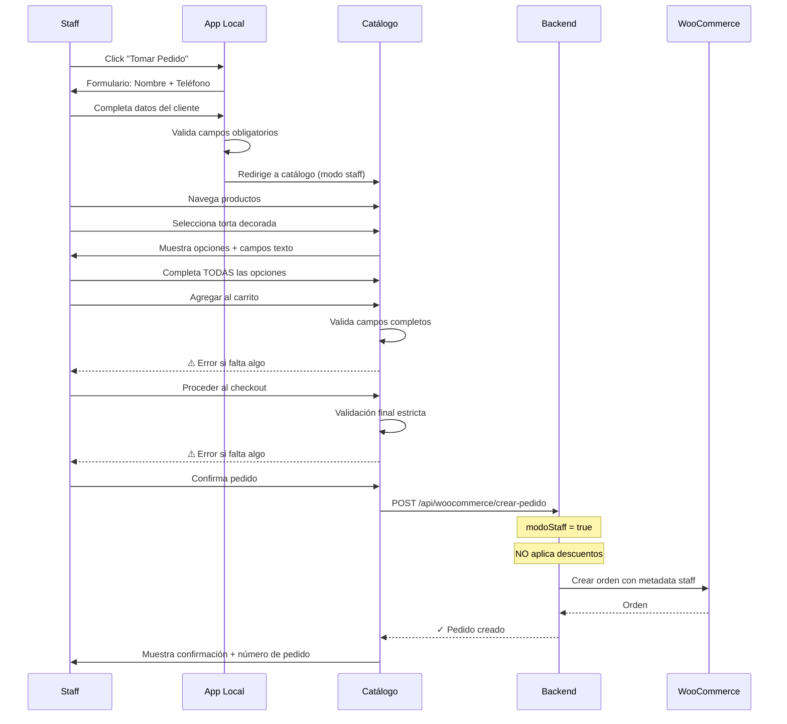

# Plan: Sistema Simple de Toma de Pedidos para Staff

## 📋 Problema a Resolver

**Situación actual:**
- Tortas decoradas tienen **muchas opciones de personalización**
- Al tomar pedidos presenciales, empleados se olvidan de preguntar/completar campos
- Información incompleta → Problemas al producir la torta

**Necesidad:**
- Formulario estructurado que **obligue** a completar toda la info
- Staff ingresa nombre + celular del cliente manualmente (sin QR)
- **NO se aplican descuentos de fidelización** (cliente no autenticado)
- Solo para 1-2 productos específicos (tortas decoradas)

## ✅ Solución Propuesta: "Modo Staff" en /tortas

### Concepto:
Agregar un **botón de acceso rápido** en la app de staff ([`/local`](../src/app/local/page.tsx)) que lleve a una versión del catálogo de tortas con:
1. Formulario inicial: Nombre + Teléfono del cliente
2. Navegación normal de productos
3. **Validación estricta**: No se puede crear pedido sin completar TODOS los campos personalizados
4. Pedido se crea en WooCommerce sin descuentos
5. Opcional: Marcar pedido como "Tomado por staff" en metadata

## 🏗️ Arquitectura

### Componente 1: Punto de Entrada en App Staff

**Ubicación:** [`/local/page.tsx`](../src/app/local/page.tsx)

```typescript
// Agregar nuevo botón en la pantalla principal
<div className="grid grid-cols-2 gap-4">
  <Link href="/local/tomar-pedido">
    <button className="bg-purple-600 rounded-xl p-6">
      <div className="text-4xl mb-2">📝</div>
      <p className="font-bold text-white">Tomar Pedido</p>
      <p className="text-sm text-purple-200">Tortas decoradas</p>
    </button>
  </Link>
  
  <button onClick={() => setVistaSalon(true)}>
    {/* Vista Salón existente */}
  </button>
</div>
```

### Componente 2: Formulario Inicial de Cliente

**Nueva página:** `/local/tomar-pedido/page.tsx`

```typescript
'use client'
export default function TomarPedidoStaffPage() {
  const [clienteData, setClienteData] = useState({
    nombre: '',
    telefono: ''
  })
  const [paso, setPaso] = useState<'datos' | 'productos'>('datos')
  
  function continuarAProductos() {
    // Validar que nombre y teléfono estén completos
    if (!clienteData.nombre.trim() || !clienteData.telefono.trim()) {
      alert('Completá nombre y teléfono del cliente')
      return
    }
    
    // Guardar en sessionStorage para usar en el siguiente paso
    sessionStorage.setItem('pedido_staff_cliente', JSON.stringify(clienteData))
    setPaso('productos')
  }
  
  if (paso === 'datos') {
    return (
      <div className="min-h-screen bg-slate-900 p-6">
        <h1 className="text-white text-2xl font-bold mb-6">
          Tomar Pedido - Datos del Cliente
        </h1>
        
        <div className="bg-slate-800 rounded-xl p-6 space-y-4">
          <div>
            <label className="block text-white font-bold mb-2">
              Nombre del cliente *
            </label>
            <input
              type="text"
              value={clienteData.nombre}
              onChange={(e) => setClienteData({...clienteData, nombre: e.target.value})}
              placeholder="Juan Pérez"
              className="w-full px-4 py-3 rounded-lg bg-slate-700 text-white"
              autoFocus
            />
          </div>
          
          <div>
            <label className="block text-white font-bold mb-2">
              Teléfono *
            </label>
            <input
              type="tel"
              value={clienteData.telefono}
              onChange={(e) => setClienteData({...clienteData, telefono: e.target.value})}
              placeholder="11 1234 5678"
              className="w-full px-4 py-3 rounded-lg bg-slate-700 text-white"
            />
          </div>
          
          <button
            onClick={continuarAProductos}
            className="w-full bg-purple-600 text-white py-4 rounded-xl font-bold"
          >
            Continuar →
          </button>
        </div>
      </div>
    )
  }
  
  // Si paso === 'productos', redirigir a catálogo
  return <CatalogoTortasStaff />
}
```

### Componente 3: Catálogo de Productos (Reutilizar)

**Enfoque:** Reutilizar la lógica de [`/tortas/page.tsx`](../src/app/tortas/page.tsx) pero en modo staff.

Dos opciones:

#### Opción A: Redirigir a /tortas con parámetro
```typescript
// En TomarPedidoStaffPage
useEffect(() => {
  if (paso === 'productos') {
    router.push('/tortas?modo=staff')
  }
}, [paso])
```

Luego en `/tortas`:
```typescript
const searchParams = useSearchParams()
const modoStaff = searchParams.get('modo') === 'staff'

// Si está en modo staff:
// - No buscar descuentos del nivel (sin token)
// - Marcar pedido como staff al crear
```

#### Opción B: Componente Compartido (Mejor)
Crear `src/components/shared/CatalogoTortas.tsx` con la lógica común:
```typescript
export function CatalogoTortas({ 
  modoStaff = false,
  datosCliente = null 
}: { 
  modoStaff?: boolean
  datosCliente?: { nombre: string, telefono: string } | null
}) {
  // Lógica de catálogo (productos, addons, campos texto)
  // Si modoStaff = true, NO aplicar descuentos
  // datosCliente se usa solo para metadata del pedido
}
```

### Componente 4: Validación Estricta de Campos

**En el checkout (carrito):**

```typescript
async function crearPedidoStaff() {
  const items = obtenerItemsCarrito()
  
  // VALIDACIÓN ESTRICTA
  for (const item of items) {
    // Verificar campos de texto personalizados
    if (item.camposTexto) {
      for (const [nombreCampo, valor] of Object.entries(item.camposTexto)) {
        if (!valor || valor.trim() === '') {
          alert(`⚠️ Falta completar: ${nombreCampo}`)
          return
        }
      }
    }
    
    // Verificar add-ons obligatorios (si los hay)
    const producto = await obtenerProducto(item.productoId)
    const addOnsObligatorios = producto.addOns.filter(a => a.obligatorio)
    
    for (const addOn of addOnsObligatorios) {
      const seleccionado = item.addOns[addOn.nombre]
      if (!seleccionado || seleccionado.length === 0) {
        alert(`⚠️ Falta seleccionar: ${addOn.nombre}`)
        return
      }
    }
  }
  
  // Si pasa todas las validaciones, crear pedido
  await crearPedido()
}
```

### Componente 5: Crear Pedido sin Descuentos

**Endpoint existente:** [`/api/woocommerce/crear-pedido`](../src/app/api/woocommerce/crear-pedido/route.ts)

**Modificación:**

```typescript
export async function POST(req: NextRequest) {
  const body = await req.json()
  const { items, fechaRetiro, horaRetiro, notasEspeciales, modoStaff, datosCliente } = body
  
  let cliente = null
  let descuentoPorcentaje = 0
  
  if (modoStaff) {
    // MODO STAFF: No buscar cliente autenticado
    console.log('[Staff Order] Pedido tomado por staff para:', datosCliente)
    // No aplicar descuentos
    descuentoPorcentaje = 0
  } else {
    // MODO NORMAL: Cliente autenticado
    const token = req.headers.get('Authorization')?.replace('Bearer ', '')
    if (!token) {
      return NextResponse.json({ error: 'No autenticado' }, { status: 401 })
    }
    
    const decoded = jwt.verify(token, JWT_SECRET) as JwtPayload
    cliente = await prisma.cliente.findUnique({
      where: { id: decoded.clienteId },
      include: { nivel: true }
    })
    
    descuentoPorcentaje = cliente?.nivel?.descuentoPedidosTortas || 0
  }
  
  // ... resto del código igual pero usando descuentoPorcentaje
  
  // Agregar metadata si es pedido de staff
  if (modoStaff && datosCliente) {
    wooOrder.meta_data.push(
      { key: '_pedido_staff', value: 'true' },
      { key: '_cliente_nombre', value: datosCliente.nombre },
      { key: '_cliente_telefono', value: datosCliente.telefono }
    )
  }
  
  const pedido = await crearEnWooCommerce(wooOrder)
  return NextResponse.json({ success: true, pedidoId: pedido.id })
}
```

## 📊 Flujo Completo



## 🎨 UI/UX Simplificado

### Pantalla 1: Datos del Cliente
```
┌─────────────────────────────────┐
│  📝 Tomar Pedido - Datos        │
├─────────────────────────────────┤
│                                 │
│  Nombre del cliente *           │
│  [________________]             │
│                                 │
│  Teléfono *                     │
│  [________________]             │
│                                 │
│  [     Continuar →    ]         │
│                                 │
└─────────────────────────────────┘
```

### Pantalla 2: Selección de Producto
```
┌─────────────────────────────────┐
│  ← Cliente: Juan Pérez          │
│     Tel: 11 1234 5678           │
├─────────────────────────────────┤
│                                 │
│  [🎂 Torta Decorada]            │
│  $68,600                        │
│                                 │
│  [🧁 Torta Temática]            │
│  $85,000                        │
│                                 │
└─────────────────────────────────┘
```

### Pantalla 3: Personalización (Crítico)
```
┌─────────────────────────────────┐
│  🎂 Torta Decorada Cumpleaños   │
├─────────────────────────────────┤
│                                 │
│  Tamaño *                       │
│  ○ Chica  ● Mediana  ○ Grande   │
│                                 │
│  Relleno *                      │
│  ☑ Dulce de leche               │
│  ☐ Crema                        │
│                                 │
│  Texto en la torta *            │
│  [Feliz cumple Martín]          │
│                                 │
│  Color de decoración *          │
│  [Azul y blanco]                │
│                                 │
│  Observaciones                  │
│  [Sin frutos secos]             │
│                                 │
│  ⚠️ Completá todos los campos   │
│     marcados con *              │
│                                 │
│  [ Agregar al Pedido ]          │
│                                 │
└─────────────────────────────────┘
```

## 🔧 Implementación

### Fase 1: Setup Básico
```typescript
// 1. Agregar botón en /local/page.tsx
<Link href="/local/tomar-pedido">
  <button className="...">Tomar Pedido</button>
</Link>

// 2. Crear /local/tomar-pedido/page.tsx
// Formulario nombre + teléfono

// 3. Usar sessionStorage para pasar datos
sessionStorage.setItem('pedido_staff_cliente', JSON.stringify({
  nombre: '...',
  telefono: '...'
}))
```

### Fase 2: Integración con Catálogo
```typescript
// Opción más simple: parámetro en URL
router.push('/tortas?modo=staff')

// En /tortas/page.tsx
const searchParams = useSearchParams()
const modoStaff = searchParams.get('modo') === 'staff'
const datosCliente = modoStaff 
  ? JSON.parse(sessionStorage.getItem('pedido_staff_cliente') || '{}')
  : null

// Mostrar banner con info del cliente
{modoStaff && (
  <div className="bg-purple-600 text-white p-4 sticky top-0 z-50">
    <p className="font-bold">📝 Pedido para: {datosCliente.nombre}</p>
    <p className="text-sm">Tel: {datosCliente.telefono}</p>
  </div>
)}
```

### Fase 3: Validación Estricta
```typescript
// En función agregarAlCarrito o procederCheckout
function validarCamposCompletos(item: ItemCarrito): boolean {
  // Verificar campos de texto
  for (const [campo, valor] of Object.entries(item.camposTexto)) {
    if (!valor || valor.trim() === '') {
      alert(`⚠️ Falta completar: ${campo}`)
      return false
    }
  }
  
  // Verificar add-ons obligatorios
  // (si WooCommerce los marca como required)
  
  return true
}
```

### Fase 4: Crear Pedido sin Descuentos
```typescript
// En /api/woocommerce/crear-pedido/route.ts
const { modoStaff, datosCliente } = await req.json()

let descuentoPorcentaje = 0

if (!modoStaff) {
  // Modo normal: buscar cliente autenticado y sus descuentos
  const token = req.headers.get('Authorization')
  // ... lógica existente
} else {
  // Modo staff: NO aplicar descuentos
  console.log('[Staff] Pedido para:', datosCliente.nombre)
}

// Agregar metadata
if (modoStaff) {
  meta_data.push(
    { key: '_pedido_staff', value: 'true' },
    { key: '_cliente_nombre', value: datosCliente.nombre },
    { key: '_cliente_telefono', value: datosCliente.telefono }
  )
}
```

## ✅ Ventajas de Este Enfoque

1. **Reutiliza código existente** - La lógica de [`/tortas`](../src/app/tortas/page.tsx) ya está
2. **Simple y seguro** - No hay riesgo porque no aplica descuentos ni accede a cuentas
3. **Evita errores** - Validación estricta de campos obligatorios
4. **Trazable** - Metadata en WooCommerce indica que fue staff
5. **Rápido de implementar** - Principalmente cambios en frontend

## ⚠️ Consideraciones

### ¿Qué pasa si el cliente ES parte del programa de fidelización?

**Escenario:**
- Cliente tiene nivel Platino (20% descuento)
- Pero viene presencialmente y NO usa su QR
- Staff carga el pedido manualmente

**Resultado:**
- Pedido se crea **sin descuento** (porque no está autenticado)
- Cliente "pierde" su beneficio de nivel

**Soluciones:**

#### Opción 1: Dejar como está (Más Simple)
- Si el cliente quiere descuento, debe usar la app
- Pedidos presenciales no tienen descuento
- Es un incentivo para usar la app

#### Opción 2: Búsqueda Opcional por Teléfono
```typescript
// Al ingresar teléfono, buscar si existe en la BD
async function buscarClientePorTelefono(telefono: string) {
  const cliente = await fetch('/api/clientes/buscar', {
    method: 'POST',
    body: JSON.stringify({ phone: telefono })
  })
  
  if (cliente) {
    // Mostrar: "Cliente encontrado: Juan (Nivel Platino)"
    // Preguntar si quiere aplicar descuento
    return {
      encontrado: true,
      nombre: cliente.nombre,
      nivel: cliente.nivel,
      descuento: cliente.nivel.descuentoPedidosTortas
    }
  }
  
  return { encontrado: false }
}
```

**Flujo con Opción 2:**
```
Staff ingresa teléfono: 11 1234 5678
  ↓
Sistema busca en BD
  ↓
✓ Cliente encontrado: Juan Pérez (Platino - 20% desc)
  ↓
Mostrar: "¿Aplicar descuento de nivel? Sí / No"
  ↓
Si Sí: Aplicar descuento (pedido vinculado a cuenta)
Si No: Sin descuento (pedido no vinculado)
```

### Recomendación:
Empezar con **Opción 1** (más simple). Si luego ves que clientes se quejan, implementar **Opción 2**.

## 📝 Resumen de Archivos a Modificar

| Archivo | Cambio | Complejidad |
|---------|--------|-------------|
| [`/local/page.tsx`](../src/app/local/page.tsx) | Agregar botón "Tomar Pedido" | Baja |
| `/local/tomar-pedido/page.tsx` | Crear formulario inicial | Baja |
| [`/tortas/page.tsx`](../src/app/tortas/page.tsx) | Detectar modo staff, mostrar banner | Media |
| [`/carrito/page.tsx`](../src/app/carrito/page.tsx) | Validación estricta, enviar modoStaff | Media |
| [`/api/woocommerce/crear-pedido/route.ts`](../src/app/api/woocommerce/crear-pedido/route.ts) | Manejar modoStaff, no aplicar descuentos | Media |

**Total:** ~5 archivos a modificar con complejidad media-baja

## 🎯 Próximos Pasos

1. **Decidir:** ¿Querés implementar esto ahora?
2. **Confirmar:** ¿Solo sin descuentos (Opción 1) o con búsqueda opcional (Opción 2)?
3. **Priorizar:** ¿Antes o después de testear el sistema de descuentos actual?
