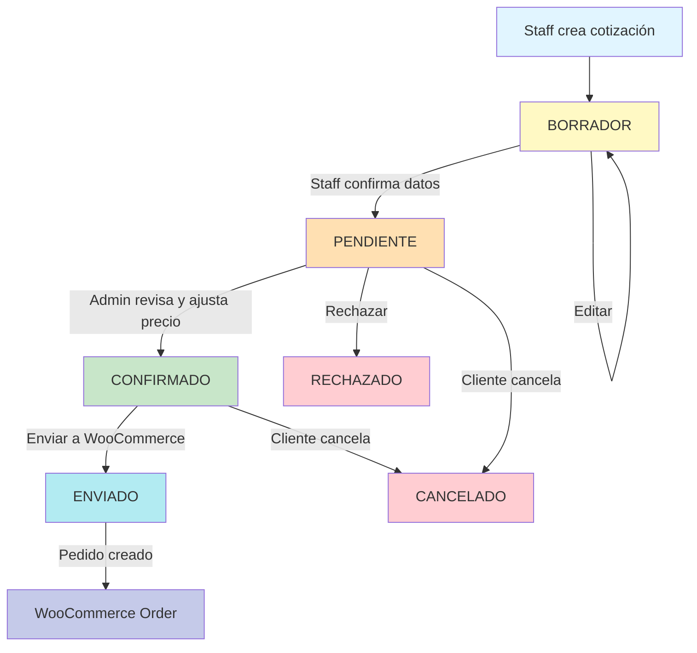

# 🎨 SISTEMA DE COTIZACIONES PENDIENTES - DISEÑO ARQUITECTÓNICO

## 📋 CONTEXTO

Actualmente, cuando staff toma un pedido de Torta Temática (SKU 20), se envía **directamente a WooCommerce**. 

**Problema:** No hay forma de:
- Revisar el pedido antes de confirmarlo
- Ajustar precio según complejidad del diseño
- Confirmar disponibilidad de materiales
- Esperar imágenes adicionales del cliente

**Solución:** Sistema de cotizaciones pendientes con estado intermedio.

---

## 🎯 OBJETIVOS

1. **Guardar cotizaciones en BD local** antes de enviar a WooCommerce
2. **Estados**: Borrador → Pendiente → Confirmado → Enviado a WooCommerce
3. **Interfaz admin** para revisar y confirmar cotizaciones
4. **Edición de precio** antes de confirmar
5. **Agregar notas internas** (ej: materiales necesarios, tiempo estimado)

---

## 🗄️ DISEÑO DE BASE DE DATOS

### Nueva tabla: `Cotizacion`

```prisma
model Cotizacion {
  id                String   @id @default(cuid())
  numero            Int      @default(autoincrement()) // Número correlativo
  
  // Relación con cliente (opcional si es pedido staff)
  clienteId         String?
  cliente           Cliente? @relation(fields: [clienteId], references: [id])
  
  // Datos del cliente (si es staff)
  clienteNombre     String?
  clienteTelefono   String?
  
  // Datos del pedido
  productos         Json     // Array de productos con configuración
  precioEstimado    Float    // Precio calculado automáticamente
  precioFinal       Float?   // Precio ajustado manualmente
  notas             String?  // Notas del cliente
  notasInternas     String?  // Notas del staff (no visibles para cliente)
  
  // Fechas
  fechaEntrega      DateTime
  horaEntrega       String
  fechaCreacion     DateTime @default(now())
  fechaConfirmacion DateTime?
  fechaEnvio        DateTime?
  
  // Estado
  estado            EstadoCotizacion
  
  // Staff que lo creó
  creadoPor         String?  // ID del empleado local
  confirmadoPor     String?
  
  // Referencia a WooCommerce (cuando se envía)
  woocommerceId     Int?
  woocommerceNumero String?
  
  createdAt         DateTime @default(now())
  updatedAt         DateTime @updatedAt
  
  @@index([estado])
  @@index([clienteId])
  @@index([fechaCreacion])
}

enum EstadoCotizacion {
  BORRADOR          // Recién creado, puede editarse libremente
  PENDIENTE         // Esperando confirmación de precio/disponibilidad
  CONFIRMADO        // Listo para enviar a WooCommerce
  ENVIADO           // Ya enviado a WooCommerce
  RECHAZADO         // No se puede realizar
  CANCELADO         // Cancelado por el cliente
}
```

---

## 📊 FLUJO DE ESTADOS



---

## 🔄 FLUJOS DE USO

### Flujo 1: Staff toma pedido (sin imágenes completas)

1. **Staff en `/local/tomar-pedido`**
   - Ingresa datos del cliente
   - Va a `/tortas?modo=staff`

2. **Selecciona SKU 20**
   - Completa campos obligatorios
   - **NO tiene todas las imágenes aún**
   - Pone URL temporal o "Pendiente"

3. **Agregar al carrito**
   - En lugar de ir directo a checkout
   - Nueva opción: **"Guardar como Cotización"**

4. **Se guarda en BD**
   - Estado: `BORRADOR`
   - Se genera número de cotización: `COT-0001`

5. **Staff puede:**
   - Continuar editando
   - Marcar como `PENDIENTE` (esperando info del cliente)
   - Agregar notas internas

6. **Cuando llegan imágenes:**
   - Staff edita cotización
   - Agrega URLs de imágenes
   - Admin revisa y ajusta precio si es necesario
   - Marca como `CONFIRMADO`

7. **Enviar a WooCommerce:**
   - Botón "Enviar Pedido"
   - Se crea en WooCommerce
   - Estado: `ENVIADO`
   - Se guarda `woocommerceId`

### Flujo 2: Cliente pide cotización (desde la app)

1. **Cliente en `/tortas` (modo normal)**
   - Selecciona SKU 20
   - Completa lo que puede
   - **Nuevo botón:** "Solicitar Cotización"

2. **Se guarda en BD**
   - Estado: `PENDIENTE`
   - clienteId registrado
   - Notificación al staff

3. **Staff revisa:**
   - Ve cotización en panel admin
   - Ajusta precio según complejidad
   - Marca como `CONFIRMADO`

4. **Cliente recibe notificación:**
   - "Tu cotización está lista: $XX.XXX"
   - Botón: "Confirmar Pedido"

5. **Cliente confirma:**
   - Se envía a WooCommerce
   - Estado: `ENVIADO`

---

## 🖥️ INTERFACES NECESARIAS

### 1. Panel Admin de Cotizaciones (`/admin/cotizaciones`)

**Vista de lista:**
```
┌─────────────────────────────────────────────────────────────┐
│ 📋 Cotizaciones                         [+ Nueva Cotización] │
├─────────────────────────────────────────────────────────────┤
│ Filtros: [Todas ▼] [Estado: Pendientes ▼] [Buscar...]      │
├─────────────────────────────────────────────────────────────┤
│ N°     Cliente          Producto       Precio    Estado    │
│ COT-12 María González   Torta Temát... $58,000  [PENDIENTE]│
│ COT-11 Juan Pérez       Torta Temát... $65,000  [CONFIRMADO│
│ COT-10 Ana López        Torta Temát... $52,000  [ENVIADO]  │
└─────────────────────────────────────────────────────────────┘
```

**Vista de detalle:**
```
┌─────────────────────────────────────────────────────────────┐
│ Cotización #COT-0012                     Estado: PENDIENTE  │
├─────────────────────────────────────────────────────────────┤
│ 👤 Cliente: María González                                  │
│ 📞 Teléfono: +54 11 4567-8901                              │
│ 📅 Entrega: 25 Feb 2026 - 17:00 hs                        │
│                                                             │
│ 🎂 Producto: Torta Temática Buttercream (25 porciones)     │
│                                                             │
│ Detalles:                                                   │
│ • Color: Rosa pastel                                        │
│ • Temática: Unicornio                                       │
│ • Mensaje: "Feliz cumpleaños Sofi"                        │
│ • Imagen: [Ver imagen] https://drive.google.com/...        │
│ • Referencia: Colores de decoración                        │
│                                                             │
│ Rellenos:                                                   │
│ • Capa 1: Dulce de leche                                    │
│ • Capa 2: Chocolate                                         │
│ • Capa 3: Dulce de leche                                    │
│                                                             │
│ Bizcochuelo: Vainilla                                       │
│ Add-ons: Cookies Temáticas (6 un.)                         │
│                                                             │
│ 💰 Precio Estimado: $58,000                                │
│ 💰 Precio Final: [________] (ajustar si es necesario)      │
│                                                             │
│ 📝 Notas del cliente:                                       │
│ "Quiero que tenga muchos brillos y purpurina comestible"   │
│                                                             │
│ 🔒 Notas internas (no visibles para cliente):             │
│ [_____________________________________________]             │
│                                                             │
│ [Rechazar] [Guardar Cambios] [Confirmar Cotización] →     │
└─────────────────────────────────────────────────────────────┘
```

### 2. Modificación en Carrito (`/carrito`)

**Botones actuales:**
- "Proceder al Checkout" → Envía directo a WooCommerce

**Nuevos botones (solo para SKU 20):**
- "Guardar como Cotización" → Guarda en BD, no envía a WooCommerce
- "Proceder al Checkout" → Mantener comportamiento actual (opcional)

### 3. Vista para Cliente (`/mis-cotizaciones`)

```
┌─────────────────────────────────────────────────────────────┐
│ 📋 Mis Cotizaciones                                         │
├─────────────────────────────────────────────────────────────┤
│                                                             │
│ ┌───────────────────────────────────────────────────────┐  │
│ │ 🎂 Torta Temática Buttercream                         │  │
│ │ Estado: ✅ CONFIRMADO                                 │  │
│ │ Precio: $58,000                                        │  │
│ │ Entrega: 25 Feb 2026 - 17:00 hs                      │  │
│ │                                                        │  │
│ │ [Ver Detalles] [Confirmar Pedido] →                  │  │
│ └───────────────────────────────────────────────────────┘  │
│                                                             │
│ ┌───────────────────────────────────────────────────────┐  │
│ │ 🎂 Torta Temática Buttercream                         │  │
│ │ Estado: ⏳ PENDIENTE                                  │  │
│ │ Precio: Por confirmar                                  │  │
│ │ Entrega: 28 Feb 2026 - 18:00 hs                      │  │
│ │                                                        │  │
│ │ [Ver Detalles] [Cancelar Solicitud]                  │  │
│ └───────────────────────────────────────────────────────┘  │
└─────────────────────────────────────────────────────────────┘
```

---

## 🔧 APIs NECESARIAS

### 1. POST `/api/cotizaciones`
Crear nueva cotización
```typescript
// Request
{
  items: ItemPedido[],
  clienteNombre?: string,
  clienteTelefono?: string,
  notas?: string,
  fechaEntrega: string,
  horaEntrega: string,
  estado: 'BORRADOR' | 'PENDIENTE'
}

// Response
{
  id: string,
  numero: number, // COT-0012
  estado: string,
  precioEstimado: number
}
```

### 2. GET `/api/cotizaciones`
Listar cotizaciones (con filtros)
```typescript
// Query params
?estado=PENDIENTE
&clienteId=xxx
&desde=2026-02-01
&hasta=2026-02-28

// Response
{
  cotizaciones: [...]
  total: number,
  pagina: number
}
```

### 3. GET `/api/cotizaciones/[id]`
Obtener detalle de una cotización

### 4. PATCH `/api/cotizaciones/[id]`
Actualizar cotización (precio, notas, estado)
```typescript
// Request
{
  precioFinal?: number,
  notasInternas?: string,
  estado?: EstadoCotizacion
}
```

### 5. POST `/api/cotizaciones/[id]/enviar-woocommerce`
Enviar cotización confirmada a WooCommerce
```typescript
// Response
{
  woocommerceId: number,
  woocommerceNumero: string,
  urlAdmin: string
}
```

### 6. DELETE `/api/cotizaciones/[id]`
Cancelar cotización (solo si no está ENVIADO)

---

## 📱 NOTIFICACIONES

### Para Staff (notificación interna)
- Nueva cotización solicitada por cliente
- Cliente confirmó cotización

### Para Cliente (email/SMS)
- Tu cotización está lista (CONFIRMADO)
- Tu cotización fue rechazada (RECHAZADO)
- Tu pedido fue enviado (ENVIADO)

---

## 🔐 SEGURIDAD & PERMISOS

### Staff (`/local`)
- ✅ Crear cotizaciones
- ✅ Ver sus cotizaciones
- ❌ Editar precio final
- ❌ Confirmar cotizaciones
- ❌ Enviar a WooCommerce

### Admin (`/admin/cotizaciones`)
- ✅ Ver todas las cotizaciones
- ✅ Editar precio final
- ✅ Confirmar cotizaciones
- ✅ Enviar a WooCommerce
- ✅ Agregar notas internas

### Cliente (`/mis-cotizaciones`)
- ✅ Ver sus cotizaciones
- ✅ Confirmar cotización (cuando está CONFIRMADO)
- ✅ Cancelar solicitud (antes de ENVIADO)
- ❌ Ver notas internas

---

## 📈 MÉTRICAS & REPORTES

Dashboard de cotizaciones:
- Total cotizaciones por mes
- Tasa de conversión (PENDIENTE → CONFIRMADO → ENVIADO)
- Tiempo promedio de confirmación
- Precio promedio por cotización
- Motivos de rechazo (si se registran)

---

## 🚀 FASES DE IMPLEMENTACIÓN

### Fase 1: MVP (Mínimo Viable)
1. Crear tabla `Cotizacion` en Prisma
2. API básica (crear, listar, detalle)
3. Guardar cotización desde carrito
4. Panel admin simple (lista + detalle)
5. Enviar a WooCommerce desde admin

### Fase 2: Mejoras
6. Edición de precio en admin
7. Notas internas
8. Estados completos (RECHAZADO, CANCELADO)
9. Vista para clientes (`/mis-cotizaciones`)
10. Confirmación de cliente

### Fase 3: Avanzado
11. Notificaciones automáticas
12. Upload de imágenes adicionales
13. Historial de cambios
14. Reportes y métricas

---

## ⚠️ CONSIDERACIONES IMPORTANTES

1. **Compatibilidad con sistema actual:**
   - Mantener flujo directo a WooCommerce (para productos simples)
   - Cotizaciones solo para productos complejos (SKU 20)

2. **Sincronización con WooCommerce:**
   - Una vez enviado a WooCommerce, la fuente de verdad es WooCommerce
   - Cotización pasa a solo-lectura
   - Cambios deben hacerse en WooCommerce

3. **Manejo de errores:**
   - ¿Qué pasa si falla el envío a WooCommerce?
   - Reintento automático
   - Notificación al admin

4. **Limpieza de datos:**
   - ¿Cuánto tiempo guardar cotizaciones RECHAZADAS/CANCELADAS?
   - Sugerencia: 90 días, luego archivar

5. **Concurrencia:**
   - ¿Qué pasa si 2 admins editan la misma cotización?
   - Implementar lock optimista (updatedAt)

---

## 🎯 DECISIONES PENDIENTES

1. **¿Permitir cotizaciones desde clientes** o solo staff?
   - Opción A: Solo staff (más control)
   - Opción B: Ambos (más flexible)

2. **¿Cotizaciones solo para SKU 20** o también otros productos?
   - Opción A: Solo SKU 20 (más simple)
   - Opción B: Configurable por producto

3. **¿Precio estimado visible para el cliente** antes de confirmar?
   - Opción A: Sí, mostrar rango ($50k - $70k)
   - Opción B: No, solo cuando admin confirma

4. **¿Permitir múltiples imágenes por cotización?**
   - Opción A: Sí, array de imágenes con categorías
   - Opción B: Una imagen por ahora (Fase 1)

---

## 📝 PRÓXIMOS PASOS

1. **Revisar este diseño** y tomar decisiones pendientes
2. **Priorizar fases** (¿Empezamos con MVP?)
3. **Implementar en Code mode**
4. **Testing exhaustivo**
5. **Deploy progresivo** (primero sin eliminar flujo actual)

---

**Fecha:** 21 de Febrero 2026  
**Autor:** Roo (Architect Mode)  
**Estado:** Diseño completo, pendiente aprobación
